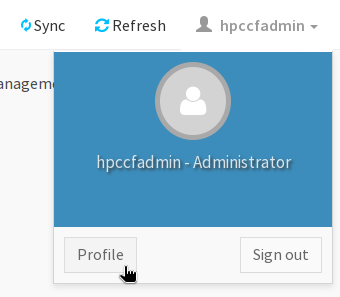
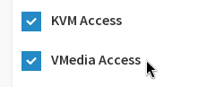
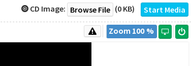
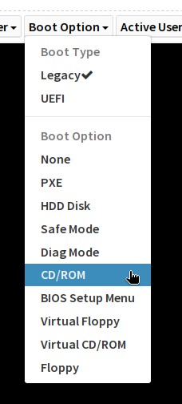

This is a HOWTO enable VMedia so an KVM session can remote-mount an ISO for installation/recovery/memtest/etc.

Note: this is **not** `Home > Settings > Media Redirection > General Settings`, that can remain off.

1. Go to `Profile` for the `hpccfadmin` user:

    

1. Click the `VMedia Access` checkbox. If `KVM Access` is unchecked, click it too.

    

1. `Save` the changes.

1. Log back into the BMC.

1. Open the KVM.

1. In the top right, select `Browse File` and select the desired ISO:

    

1. Force the system to boot from the `CD/ROM`, most easily accomplished from the KVM's `Boot Option` menu:

    

1. Boot/Reboot the system. It should boot into the mounted ISO, which will stream from your system.

1. Profit! Or at least a lot less hair tearing trying to mount remote images.
