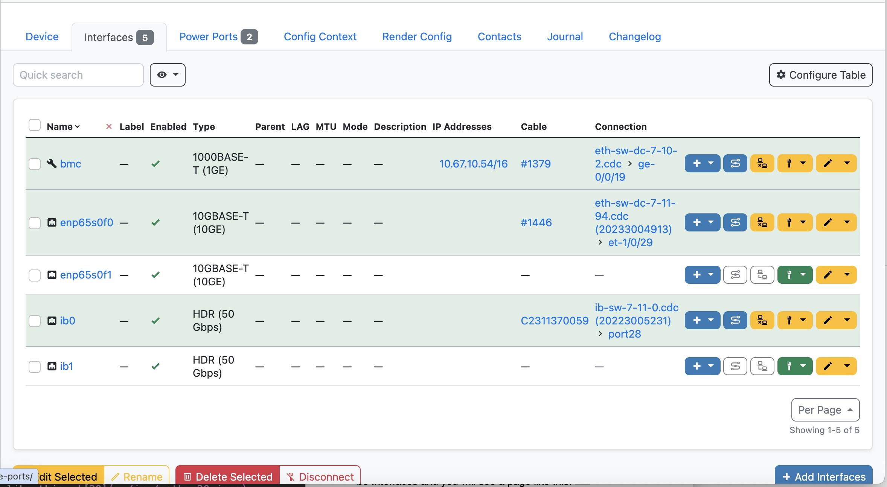
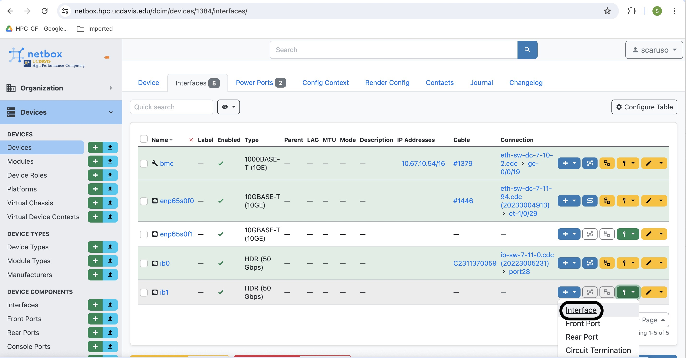
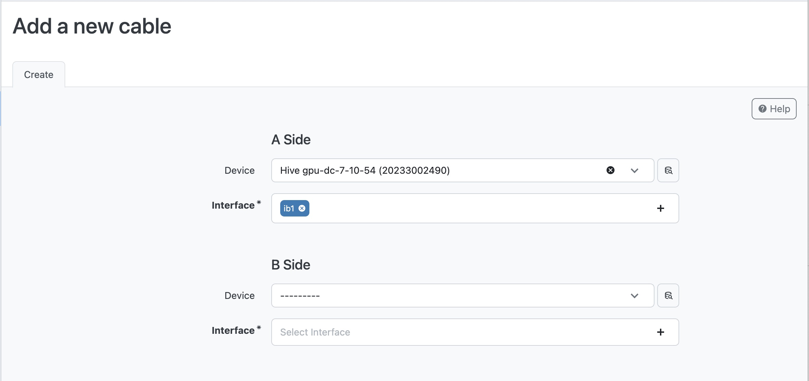
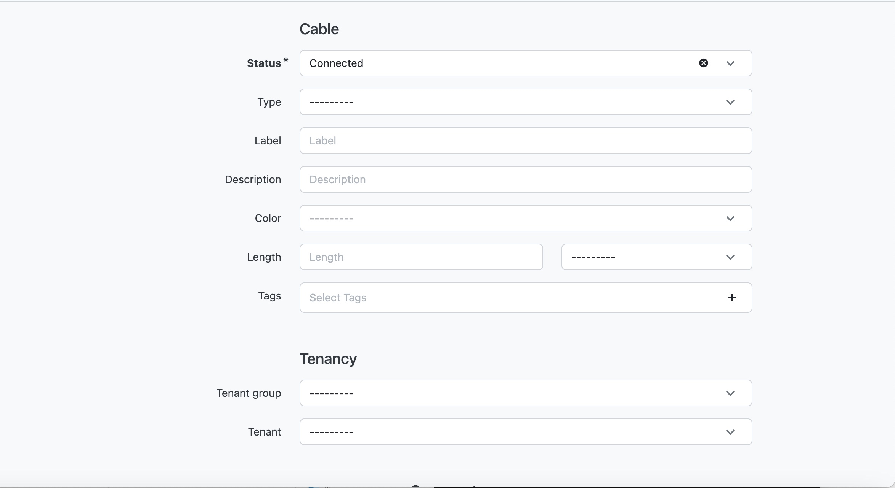
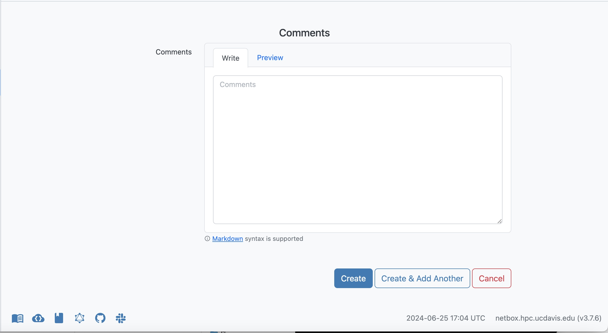
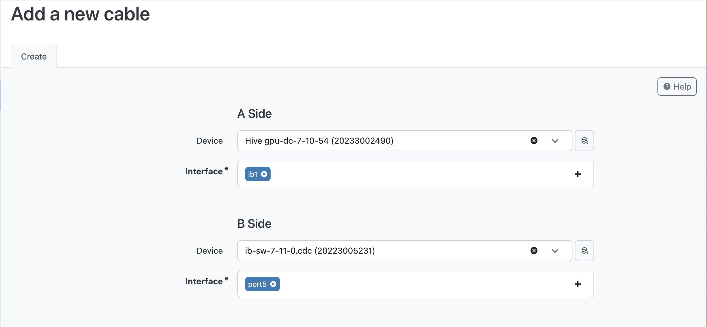
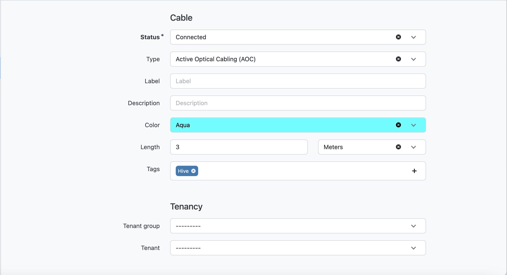
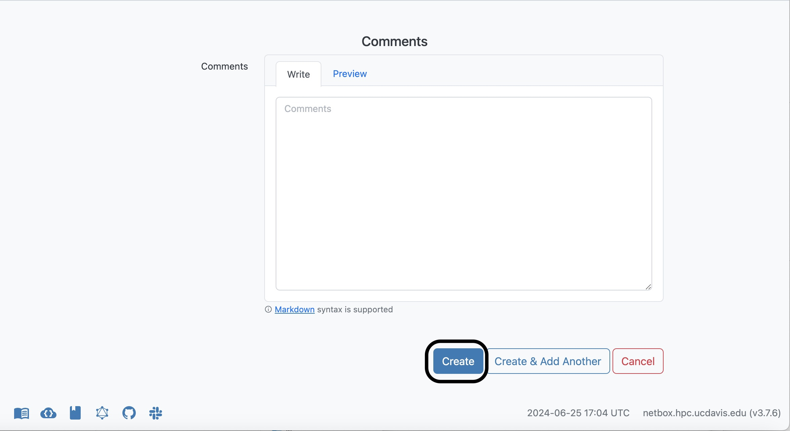

# Netbox
## HPCCF's Source of Truth
[HPCCF's Netbox Site](https://netbox.hpc.ucdavis.edu/dcim/sites/)

NetBox is an infrastructure resource modeling (IRM) application designed to empower network automation. NetBox was developed specifically to address the needs of network and infrastructure engineers.

## Netbox Features

- Comprehensive Data Model
- Focused Development
- Extensible and Customizable
- Flexible Permissions
- Custom Validation & Protection Rules
- Device Configuration Rendering
- Custom Scripts
- Automated Events
- Comprehensive Change Logging

## Netbox Administration

- This section will give an overview of how HPCCF admins utilize and administer Netbox

### How to add assets into Netbox

1. Navigate to HPCCF's Netbox instance here: [HPCCF's Netbox Site](https://netbox.hpc.ucdavis.edu/dcim/sites/) 
2. Select the site to which you will be adding an asset too. In this example I have chosen Campus DC: 
3. Scroll down to the bottom of this page and select which of the locations you will add your asset too, here I chose the Storage Cabinet:  
4. On this page scroll to the bottom and select Add a Device: 
5. After you have selected Add a Device you should see a page like this: 
6. Fill out this page with specifics of the asset, some fields are not required but try to fill out this section as much as possible with the fields available, here is an example of a created asset and how it should look: 
7. Ensure to click on Save to have the device added.

### How to add components to an Asset

1. On the asset page select the + Add Components dropdown and select the component you wish to add, for this I have chosen a Console Port: 
2. Here again you will fill out the dropdowns as thoroughly as possible, the example here is of an interface that has already been added: 
3. Again make sure to click Save to ensure the component has been added.
4. This process can be used to add all of the following componentes to a device:

### How to connect components

1. After a component has been created such as an interface, power port or any other type of component you will want to connect it to something. For any component the process is similar within Netbox. In this example it will show how to connect an Infiniban port on a device to a port on an Infiniban switch. First navigate to the device you wish to work with and select the appropriate tab, in this case it will be Interfaces and you will see a page like this: 
2. Here we will connect ib1 to an infiniban switch by clicking the green dropdown off to the right of ib1 and we will be connecting to another interface on the infiniban switch so we will choose interface as shown here: 
3. Once selected you will come to a screen that looks like this: 
4. Once all filled out with the required information to complete the connection (and any additional information that can be provided) at the bottom make sure to create the connection, your screen should look something like this: 