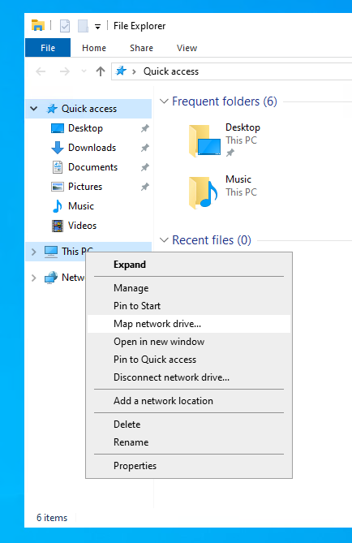
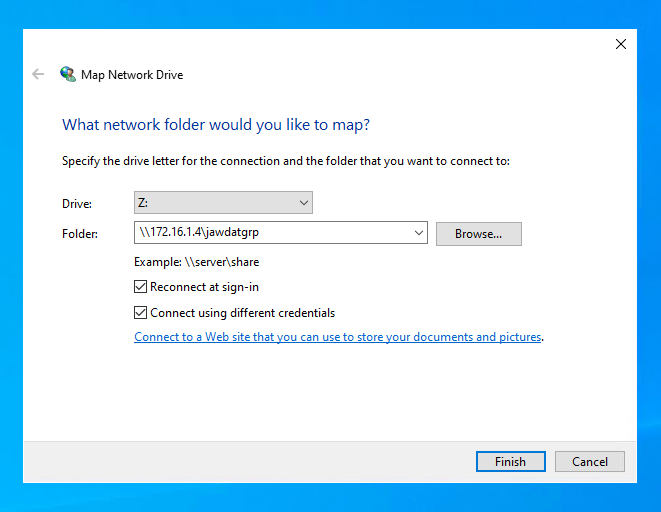
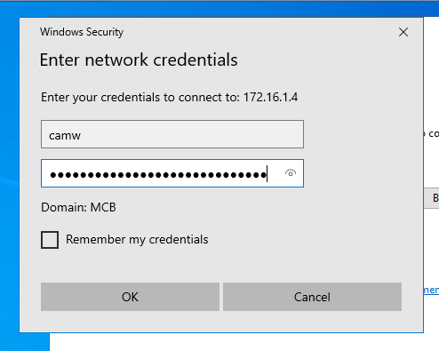
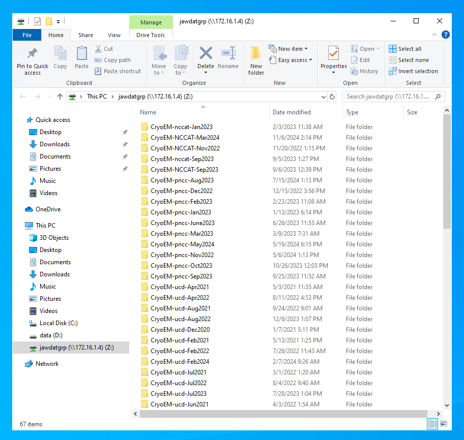
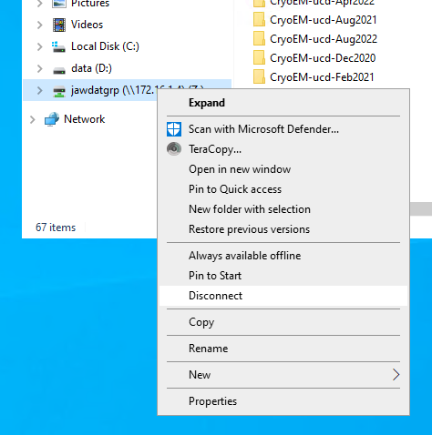

## Home Directories

All users are allocated 20GB of storage for their home directory.
This space is free and not associated with lab storage quotas.

## Lab Storage Allocations

Research data should be stored on lab storage allocations. 
These allocations are mounted at `/group/[PI_GROUP_NAME]`.
Note that these directories are mounted as-needed, so your particular allocation might not show up when you run `ls /group`; you will need to access the path directly.
You can find your PI group name by running `groups`: this will output your user name and a name ending in `grp`.
The latter corresponds to the directory name under `/group`, unless otherwise requested by your PI.

## Lab Storage Sharing

Franklin lab storage allocations have been made available to the Cryo-EM facility Windows computers
via [Samba](https://en.wikipedia.org/wiki/Samba_(software)).
Users can mount these drives on the
microscope control computer and the "Warp" computer using a Samba username and password provisioned on
request.
To mount a lab store, proceed as follows:

### 1. Request a Samba Username and Password

Email [hpc-help@ucdavis.edu](mailto:hpc-help@ucdavis.edu?subject=Franklin%20Samba%20access%3A%20USERNAME) 
with the subject line `Franklin Samba access: [USERNAME]`, where `[USERNAME]` is your account name on Franklin.
An admin will provision your Samba account, and your password will be placed in a file within your home
directory located at `~/samba-password`.
Note that this file will have its permissions set to be readable _only by your user_ -- do not change them!

### 2. Access a Cryo-EM Facility Machine

The Samba shares are only available on the Cryo-EM facility internal network.
For now, this means the "Warp" machine and the "K3" microscope machine, as well as
the lab workstations (though the latter machines already have access via NFS).
The remote access machine at `workathome.mcb.ucdavis.edu` is __not__ on that network
and hence does not have access at this time.
Access one of these machines, either physically from within the microscope room or
via remote desktop by remoting first to `workathome` and then to the target machine.

### 3. Map the Drive

Windows mounts Samba shares natively.
First, through the File Browser, right-click __"This PC"__ and select __"Map network drive..."__

<figure markdown>
{ width="300"}
</figure>

In the network drive dialogue box, enter `\\172.16.1.4\[STORAGE_NAME]`, where `[STORAGE_NAME]` corresponds 
to the name of your storage directory on franklin.
Usually, this is the name of your group, such as `cashjngrp` or `jalettsgrp`.
Make sure to also select the __Connect using different credentials__ checkbox.

<figure markdown>
{ width="600"}
</figure>

Hit __"Finish"__, at which point you should be presented with a password prompt.
Enter your Franklin username and the password from your `~/samba-password` file.

<figure markdown>
{ width="400"}
</figure>

Your storage array will now be available at the mapped location (in this example, at `Z:`).
Any files you write will be owned by your Linux user and your lab's group.

<figure markdown>
{ width="600"}
</figure>

If you are logged in to Windows with a shared user, make sure to disconnect when you are finished.
Do this by right-clicking the mapped drive in the File Explorer and selecting __"Disconnect"__.

<figure markdown>
{ width="400"}
</figure>
