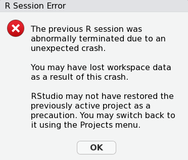
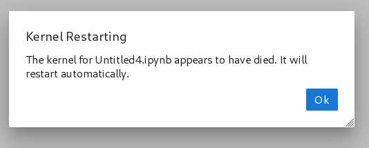

{ align="left" style="height:50px;width:50px"}

# Open OnDemand

Some HPC@UCD clusters have [Open OnDemand](https://openondemand.org/) (OOD). OOD allows access to cluster resources
using a web browser. All OOD apps are automatically launched through Slurm jobs, so you have access to your normal
cluster resources. Just like `sbatch` jobs, OOD apps (jobs) run even when your browser is not attached, so you can
reattach to a running OOD app just by going back to the OOD website.

## Clusters with Open OnDemand:

-   [Farm](https://ondemand.farm.hpc.ucdavis.edu)
-   [Franklin](https://ondemand.franklin.hpc.ucdavis.edu)
-   [Hive](https://ondemand.hive.hpc.ucdavis.edu)

## Applications offered with Open OnDemand

-   JupyterLab
-   [Cluster Name] Desktop
-   VSCode Server
-   RStudio Server

## Desktop notes

HPC@UCD provides a full Ubuntu Desktop using the XFCE4 desktop environment. Chrome and Firefox are included, and can be
used to download data. This desktop is **not** intended for long term use. To prevent issues, your Firefox and Chrome
data saved on the cluster is deleted every time you launch a new desktop session. This prevents left-behind lock files
from blocking browser launch when the Slurm job terminates before you exit the desktop session.

## User OnDemand debugging

If your OOD jobs launches, but fails very quickly, please click the long, random `Session ID:`. From there, open the
`output.log` file and carefully look over the output.

### Incorrect Conda environment specified

Some OOD Apps allow you to specify a specific conda environment that will load. If you see a line like this in
`output.log`, you have specified an invalid conda environment:

```
EnvironmentNameNotFound: Could not find conda environment: r-4.3.3-typo
You can list all discoverable environments with `conda info --envs`.
```

### RStudio R version change error

If upon loading the RStudio IDE, you see an error like the following:

```
Connected to your session in progress, last started 2025-May-23 22:35:30 UTC (3 days ago)
R version change [4.2.3 -> 4.4.2] detected when restoring session; search path not restored
```

You can resolve these errors by clearing your rstudio session cache which you can learn to do
[here](rstudio.md#clearing-your-r-cache)

### Unable to install.packages()

If you find you are unable to install.packages() you might be suffering from
[this issue](#rstudio-r-version-change-error)

### Out of Memory (OOM) events

If your Jupyter or RStudio jobs keep failing with errors like `abnormally terminated due to an unexpected crash`, and,
when your job finishes, you see a line like this in `output.log`, then you have not requested enough RAM:

```
slurmstepd: error: Detected 3 oom_kill events in StepId=20294700.batch. Some of the step tasks have been OOM Killed.
```

Other indications of an OOM event are an RStudio or Jupyter window like these:

???+ note "Screenshots"

    

    

### Self installed conda or miniconda break RStudio Server

If you self-install conda, or miniconda, it will conflict with our centrally installed conda. If you see lines like
this, then you need to remove that to use RStudio Server:

```
ERROR: CONDA_EXE is currently defined: /home/omen/conda/bin/conda.
This module will almost certainly interfere with your conda installation.
Remove existing conda installation and its shell hooks from your PATH before proceeding.
```

See [Migrating from User-installed Conda](conda.md#migrating-from-user-installed-conda)

### Time limit

If you see output like this, it means you did not request enough hours during the app configuration in OOD:

```
slurmstepd: error: *** JOB 20296118 ON cpu-6-96 CANCELLED AT 2025-01-21T17:34:19 DUE TO TIME LIMIT ***
```

### Failed to submit session with the following error (QOSMaxMemoryPerJob):

```
sbatch: error: QOSMaxMemoryPerJob
sbatch: error: Batch job submission failed: Job violates accounting/QOS policy (job submit limit, user's size and/or time limits)
```

If your job is rejected at submission time with this error, it means you requested resources that are not available in
the `Account`/`Partition` you specified. Normally you should work with your PI to find out what resources are available.
On Hive, in `publicgrp`/`high` (the free-tier), the limits [are documented here](../scheduler/free-access.md).

### Failed to submit session with the following error:

```
sbatch: error: Batch job submission failed: Requested node configuration is not available
```

If your job is rejected at submission time for reasons like this (basically anything that starts with `sbatch: error:`),
please work with your PI to figure out an appropriate partition and resource request.

### Other error

If your issue is not listed here, please [submit a ticket](../support.md) and send the cluster name, the OnDemand app
you ran, a list , the `Session ID` of the failed job, any errors you noticed, and any troubleshooting you performed. You
**must** supply all of this information for HPC@UCD to be able to debug issues.
